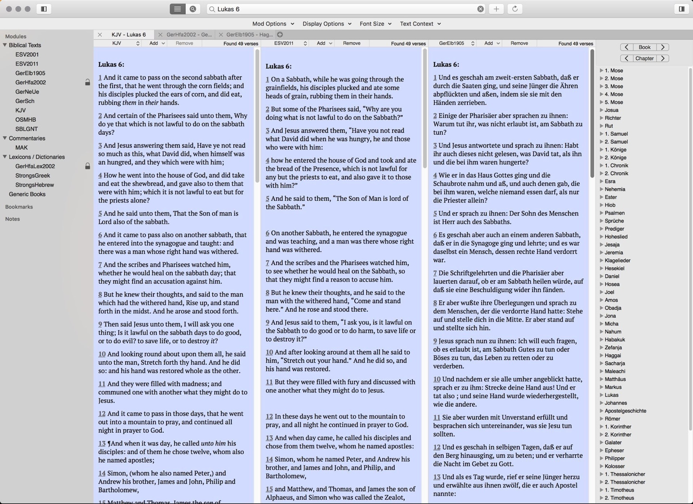

Improvement:

1. Installation and Setup Instructions
Add step-by-step installation instructions for macOS, including necessary dependencies.

2. Feature Description:
Provide more details on key features like support for different Bible translations, text search, and note-taking capabilities.

3. Application Usage:
Add usage instructions, including details on how to open multiple pages, supported by the existing screenshots.

# Eloquent

Eloquent is a free & open-source application for research and study of God and His Word. It is developed specifically for Macintosh computers running macOS.

Eloquent allows you to read and browse many different bibles translations in different languages from Hebrew to Albanian. As well as reading devotionals, commentaries, dictionaries and lexicons, it also supports searching and advanced features such as services so that you can access the Bible in any program.

And because Eloquent is based on the [Sword project](https://crosswire.org/sword/index.jsp), it is compatible with an uncountable number of texts that are available via the built-in module manager in over 50 languages.

Key Features:

Multi-translation Support: View and compare different Bible translations side by side.
Search Capabilities: Easily search through different texts for specific verses or keywords.
Module Manager: Install and manage Bible translations, devotionals, and other resources directly from the app.
Commentary and Lexicon Support: Gain deeper understanding with integrated commentaries and lexicons.
Cross-app Integration: Access the Bible in any program using macOS services.

Usage Instructions:

Reading the Bible: Open the app, and choose your preferred translation from the module manager.
Opening Multiple Pages: You can open multiple Bible translations or commentaries by selecting the "New Tab" option. Each tab can display a different resource side by side.
Text Search: Use the search bar at the top to search for specific verses, keywords, or phrases within your selected translations.

# Download releases
Releases can be downloaded under this link:
https://github.com/mdbergmann/Eloquent/releases

Installation Instructions
macOS Installation
Download Eloquent: Go to the Releases page and download the latest version for macOS.
Install Dependencies: Ensure that you have all necessary libraries installed, such as Sword libraries. Use Homebrew for easy installation:
bash
brew install sword
Run the Application: Open the downloaded app file, and if macOS prompts that the app is from an unidentified developer, go to System Preferences > Security & Privacy and allow the app to run.

# Screenshots

Single bible text tab

Tripple bible text tab

Tripple bible text with commentary tab

